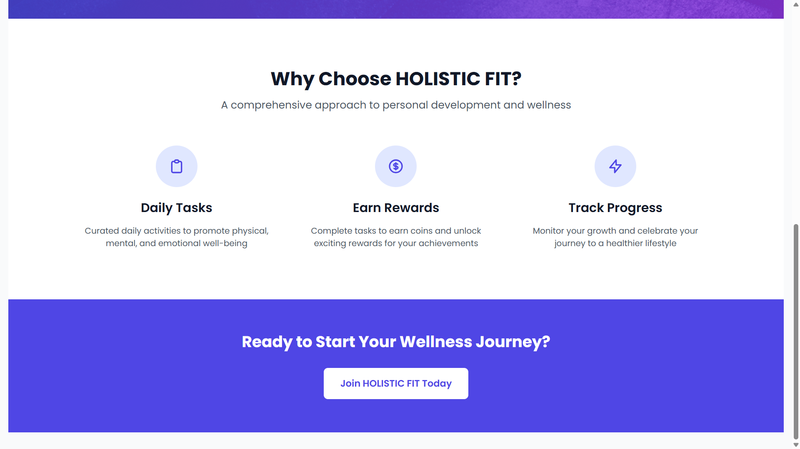
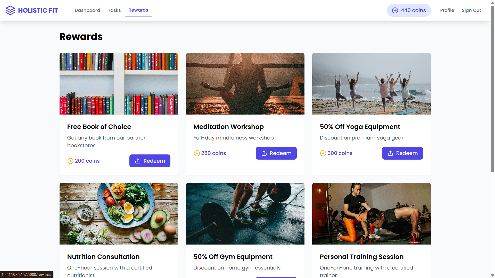

# HolisticFit - A Task-Based Mental and Physical Well-Being Platform

HolisticFit is a web-based platform designed to enhance mental and physical well-being using a task-based approach. It allows users to complete tasks, track progress, earn rewards, and engage in a supportive community.

---

## **Home Page**
The landing page of HolisticFit, providing an interactive and engaging user experience.

---

## **Dashboard**
A centralized space for users to track their fitness and mental well-being progress.

---

## **Profile Page**
The user profile section displays personal progress, achievements, and settings.

---

## **Purpose**
This section highlights the core objectives of HolisticFit and its impact on users.

---

## **Tasks**
Users can engage in various tasks to improve their fitness and mental well-being.

---

## **Rewards**
Users earn points for completing tasks, which can be redeemed for rewards.

---

## **Redemption Page**
A page where users can exchange earned points for benefits.

---

## **Features**
- 📌 **Task-Based Engagement** - Users complete tasks to improve well-being.
- 🎯 **Progress Tracking** - Visualize achievements and improvements.
- 🏆 **Reward System** - Earn and redeem points for completing tasks.
- 🔒 **Secure Authentication** - User data is securely managed.
- 💡 **Minimalist & Interactive UI** - Smooth navigation with a modern design.

---

## **Contact For Source Code**
For any inquiries or collaborations, reach out to:
📧 Email: iamtsr2004@gmail.com 
🔗 LinkedIn: [Sunhith Reddy T ] ( www.linkedin.com/in/sunhithreddy )  
📸 Instagram: [sunhith_reddy]   (https://www.instagram.com/sunhith_reddy)  
---

### **License**
This project is licensed under the MIT License - see the [LICENSE](LICENSE) file for details.

